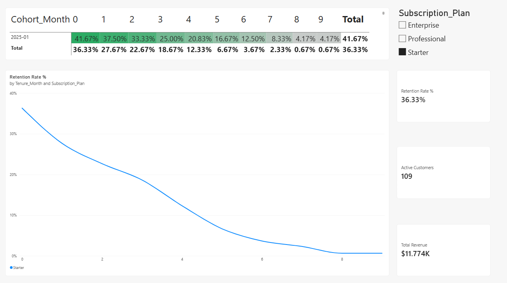

# 📊 B2B SaaS Customer Retention & Churn Analysis

## 📌 Executive Summary
This project delivers an end-to-end data analytics solution evaluating customer retention, churn decay, and Monthly Recurring Revenue (MRR) performance across subscription tiers (**Starter**, **Professional**, **Enterprise**). 

By combining **Python** for raw data generation, **Excel** for cohort model validation, and **Power BI** for interactive reporting, this analysis identifies key drop-off points along customer tenure to optimize retention strategies.

---

## 🛠️ Tech Stack & Tools
* **Python (Pandas, NumPy):** Simulated production-grade B2B SaaS billing logs and engineered tenure/cohort features.
* **Excel:** Built a dynamic cohort retention matrix (`XLOOKUP`, `SUMIFS`, `COUNTIFS`) to audit baseline metrics.
* **Power BI:** Developed DAX measures, a color-coded retention heatmap matrix, tenure churn curves, and dynamic plan slicers.
* **Git/GitHub:** Version control and portfolio documentation.

---

## 📈 Key Insights & Business Findings
* **Early Churn Risk:** The sharpest drop-off occurs between **Tenure Month 0 and Month 1** (M1 Retention sits at ~27-36%), indicating potential friction during onboarding.
* **Tier Performance:** Higher-tier subscriptions (**Enterprise**) demonstrate stronger long-term retention compared to lower-tier plans (**Starter**).
* **Revenue Impact:** Flattening churn curves beyond Month 6 show that customers who survive early tenure yield steady, highly predictable LTV.

---

## 🖼️ Dashboard Preview

---

## 📁 Repository Structure
