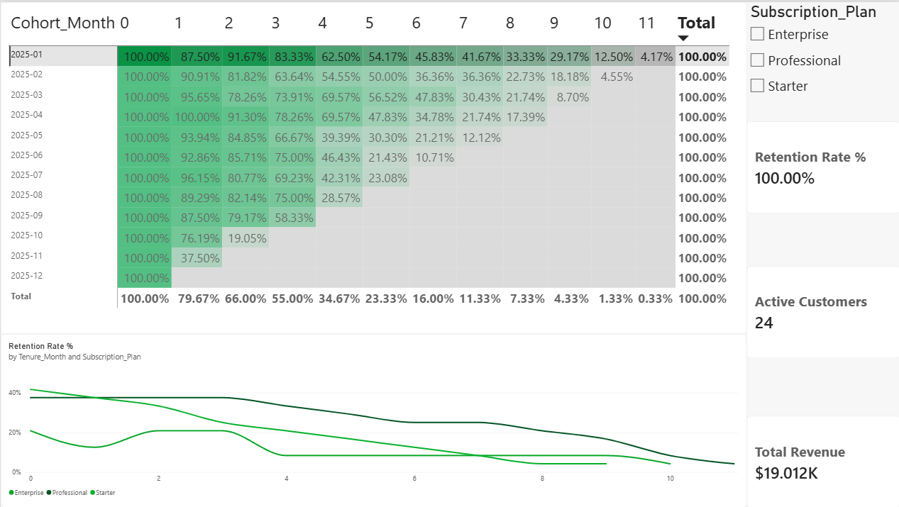

# B2B SaaS Customer Retention & Churn Analysis

## 🚀 Project Overview
An end-to-end data analytics solution evaluating customer retention, churn decay, and Monthly Recurring Revenue (MRR) performance across subscription tiers (*Starter, Professional, Enterprise*). This portfolio project combines Python for data generation, Excel for cohort model validation, and Power BI for interactive executive reporting.

🛠️ Architecture & Tech Stack
Data Generation & Simulation: Python (`generate_saas_data.py`) utilizing Pandas and NumPy to simulate billing logs.

Model Validation: Microsoft Excel (`B2B_SaaS_Retention_Analysis.xlsx`) featuring dynamic cohort matrices (XLOOKUP, SUMIFS, COUNTIFS).

Visualization & BI: Power BI Desktop (`B2B_SaaS_Retention_Dashboard.pbix`) featuring customized corporate green-themed UI/UX design standards.


📊 Key Dashboard Features
Executive KPI Cards: Real-time tracking of Retention Rate %, Active Customers ($109$), and Total Revenue ($\$11.774\text{K}$).

Retention Heatmap Matrix: Color-coded matrix breaking down cohort retention month-over-month.

Tenure Churn Curves: Visualizing customer drop-off trajectory across subscription tiers.

Interactive Slicers: Dynamic filtering across Enterprise, Professional, and Starter subscription tiers.

📸 Dashboard Preview


🎬 Interactive Workflow Demo


⚙️ How to Run This Project
Generate Dataset: Run `generate_saas_data.py` via Python to simulate or refresh the raw billing logs.

Audit via Excel: Open `B2B_SaaS_Retention_Analysis.xlsx` to review the underlying cohort formulation models and validation logic.

Launch the Dashboard: Open `B2B_SaaS_Retention_Dashboard.pbix` in Power BI Desktop to explore the data model, measures, and interactive visuals.

---

## 📂 Repository File Structure
```text
├── B2B_SaaS_Retention_Dashboard.pbix     # Interactive Power BI Retention & Churn Report
├── B2B_SaaS_Retention_Analysis.xlsx      # Excel dynamic cohort model & validation workbook
├── generate_saas_data.py                 # Python script for generating billing logs & cohort features
├── Raw_SaaS_Billing_Logs.csv             # Raw simulated B2B SaaS subscription & billing dataset
├── B2B_Retention_Dashboard_preview.png   # Dashboard architectural preview image
├── B2B_Retention_Dashboard_demo.gif      # Interactive workflow preview animation
└── README.md                             # Project documentation & portfolio overview
